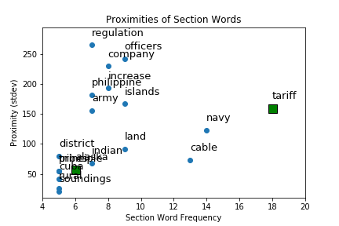
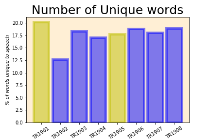

# SpeechAnalysis
This project is intended for me to practice Natural Language Processing (NLP) techniques using presidential inaugural and State of the Union (SotU) addresses.

Being fairly new to this sort of analysis and coding in general, if you notice ways that I could improve the code (i.e. make it cleaner/faster, inaccuracies found, etc) message me and let's get in touch!

## TR1902.ipynb
In an effort to save myself some effort, I started this analysis by focusing on only one speech by only one president: Teddy Roosevelt's 1902 first State of the Union speech.

### Preparing the text
After importing dependencies, the speech text is read into the script and Stopwords ("a","the","i", and [various other common words](https://gist.github.com/sebleier/554280 "NLTK list of Stopwords")) are removed.

### Bag of Words
With the stopwords removed, tokenization of the text is more meaningful. The text is essentially split on the spaces, so each word is an individual item in a long list (bag) of words. Not all tokens are created equal, so my next step is to remove the punctuation and numbers from the text.

Now the Bag of Words is useful for NLP. The first method I use is to saerch for the most common words used, removing all words used fewer than 4 times to avoid noise from words used very few times and focus on more prominent words.
* _Note: Future versions of this should **lemmatize** the text, turning variants of a word into the root word ("increasing"/"increased" = "increase")._

### Determine sections/topics of speech
Using the number count and the index (location) of the words in the text, I was able to derive the word's **standard deviation** (StDev). Words that are used frequently throughout the text should have a higher StDev and those used frequently in only a portion of the text should have a lower StDev. Knowing this statistic for each word allows for Topic Identification within the text.

Via a quick plotting of the results we can see that, indeed, Teddy focuses his speech on certain topics:

**Word Frequency vs. Word StDev**

### Analysis
* "Tariff", "navy", and "cable" are words that particularly stand out. Each of these words has a high frequency and are relatively close together in the speech.

* A closer look is needed, but at first glance "tariff" appears to refer to Teddy's anti-trust agenda. Indeed, the 14 instances of "tariff" in the speech align with a paragraph or two, so this method appears to be identifying sections of this speech well.

* Teddy's inherent affinity for a strong navy (he gained reknown among military elite for his publishing of 'The Naval War of 1812' in 1882) leads me to believe the term "navy" likely plays a role in several of his speeches, State of the Union and otherwise. Further analysis will need conducted to confirm this, however.

* "Cable" seemed like an interesting word for 1902. When I looked this up in the text document, I found this is referring to the [Trans-Pacific Cable](https://en.wikipedia.org/wiki/Commercial_Pacific_Cable_Company "Wikipedia page referring to TPC"), a telegraph cable intended to connect America to the Philippines (via Hawaii) and to China and Japan.

### Future Steps
* N-Gram analysis
* Sentiment analysis

## TR_Speech_Comparison
The next step to expanding upon the above analysis is to increase the number of documents analyzed and make comparisons between them. This notebook is still a work in progress, as comparing the documents adds many new tools, including "Term Frequency-Inverse Document Frequency" ([TF-IDF](https://en.wikipedia.org/wiki/Tf%E2%80%93idf "Wikipedia page for TF-IDF")), which assigns weights to words based on a word's "importance" to a particular document vs. the corpus (body of documents).

### Observations
Since is isn't really a completed analysis, I'm calling this section "Observations", as these are interesting results that will be guiding the analysis going forward.

* Above are listed the number of words unique to each speech (TF-IDF = 1). TR's 1902 speech appears to be his least "original" by far. 1902 would have been his first State of the Union address, so perhaps he recycled many of the ideas of his inaugural address? More investigation will be necessary to confirm.

* In the Bag of Words approach, it was observed that the 1902 speech was TR's least repetitive and the 1907 speech was the most repetitive. The TF-IDF anaylsis shows 1907 to be relatively "original" while 1902, as mentioned, has the fewest words which are unique to that speech. This is interesting and seems to suggest a correlation between repeated and unique words in a speech, though it certainly does not confirm this observation.

* This analysis doesn't really show all that much, but with a bigger corpus (the whole of the speeches collection) it may be much more interesting.

